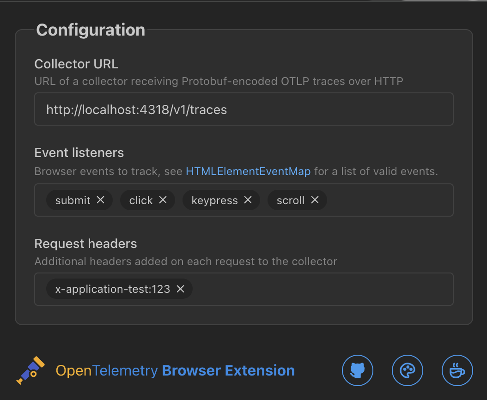

<div align="center">
    <p style="font-size:2rem">Open<span style="font-weight:bold">Telemetry</span> Browser Extension</p>
    <p>published builds available on:</p>
    <a href=""></img></a>
    *
    <a href=""></img></a>
    *
    <a href=""></img></a>
    <p>...or <a href='#making-a-production-build'>build it yourself!</a></p>
</div>


## About

> [!NOTE] 
> This project is in early development. Please forgive (or feel free to contribute) any missing documentation.

A [Plasmo](https://docs.plasmo.com/)-based browser extension that automatically instruments webpages with [OpenTelemetry](https://opentelemetry.io/docs/what-is-opentelemetry/).

[Download it](https://chromewebstore.google.com/detail/opentelemetry-browser-ext/bgjeoaohfhbfabbfhbafjihbobjgniag), refresh your pages, and automatically start emitting OTLP logs and traces from webpages of your choosing.

## Preview



## Features

* Automatically instrument your webpages to collect traces and logs, sent to an OTLP-compatible collector
* No content-security policy errors! Works around typical CSP limitations by making `fetch` requests from the background script instead of the webpage
* Propagate b3 and w3c trace context to websites of your choosing (matched by regular expressions)


## Browser compatibility

Because this extension relies on the use of `chrome.scripting.executeScript({ ... , world: 'MAIN' })`, it is only compatible with browsers which support the `MAIN` execution world as a parameter. Luckily, this seems to include every browser except Firefox ([where development to support the feature is in-progress](https://bugzilla.mozilla.org/show_bug.cgi?id=1736575)).

## Developing

Initialize submodules (we use a custom build of Plasmo):

```bash
git submodule update --init --recursive
```

Install dependencies:

```bash
pnpm install
```

Start the OpenTelemetry stack (Grafana + Quickwit + `opentelemetry-collector-contrib`):<sup> (optional if you have your own)</sup>
```bash
docker compose up -d
```

Run the development server:

```bash
pnpm dev
```

Then, open your browser and load the appropriate development build. For example, if you're developing for Chrome, using manifest v3, use: `build/chrome-mv3-dev`.

## Making a production build

Run the following:

```bash
pnpm build
```
or, for targeting a specific browser:

```bash
pnpm build:chrome
# or
pnpm build:safari
# or
pnpm build:edge
```

Then, follow the same steps as with running the development server, but load the appropriate production build from the `build` directory, i.e: `build/chrome-mv3-prod`.

### Safari

Safari requires a bit of extra work. After building the extension, run the following command to convert the extension to a an XCode project:

```bash
cd build && xcrun safari-web-extension-converter safari-mv3-prod
```

Then, build the extension in XCode (using the MacOS target), and enable it in Safari

> [!NOTE]
> Safari requires extensions to be signed before they can be installed. You can either sign the extension yourself, or load it as an unsigned extension after enabling "allow unsigned extensions" in Safari's developer settings.
