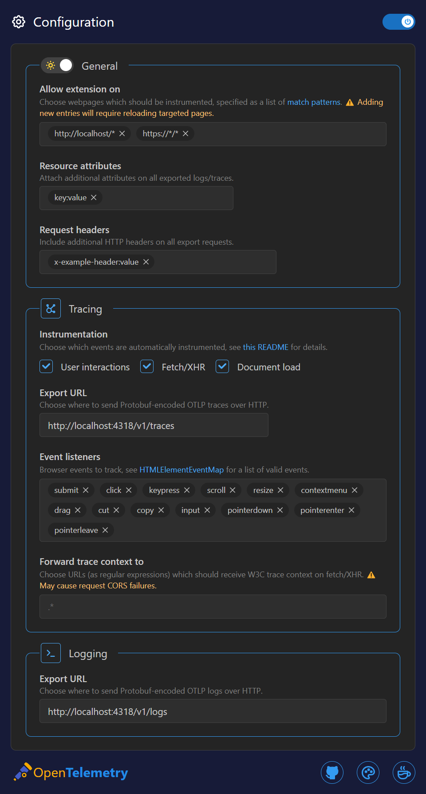

<div align="center">
    <h1>OpenTelemetry Browser Extension</h1>
    <p>available on:</p>
    <a href="https://chromewebstore.google.com/detail/opentelemetry-browser-ext/bgjeoaohfhbfabbfhbafjihbobjgniag"></img></a>
    /
    <a href="https://apps.apple.com/us/app/opentelemetry-browser-ext/id6503631744?mt=12"></img></a>
    /
    <a href="https://microsoftedge.microsoft.com/addons/detail/opentelemetry-browser-ext/agbimhpapcebokbphphbfcimebibcoga"></img></a>
    <p>...or <a href='#making-a-production-build'>build it yourself!</a></p>
</div>


## About

> [!NOTE] 
> This project is in early development. Please forgive (or feel free to contribute) any missing documentation.
> This project is largely similar to the archived [opentelemetry-browser-extension](https://github.com/open-telemetry/opentelemetry-js-contrib/tree/main/archive/opentelemetry-browser-extension-autoinjection) (by [@svrnm](https://github.com/svrnm/opentelemetry-browser-extension/)), but avoids CSP issues with a different content script injection method, offers a few more configurable settings in the UI, and was developed independently.

A [Plasmo](https://docs.plasmo.com/)-based browser extension that automatically instruments webpages with [OpenTelemetry](https://opentelemetry.io/docs/what-is-opentelemetry/).

[Download it](https://chromewebstore.google.com/detail/opentelemetry-browser-ext/bgjeoaohfhbfabbfhbafjihbobjgniag), choose where you want it to run, and automatically start emitting OTLP logs and traces.

## Preview



## Features

* Automatically instrument webpages to collect traces and logs, sent to an OTLP-compatible collector
* No content-security policy errors! Works around typical CSP limitations by making `fetch` requests from the background script instead of the webpage and using `chrome.scripting.executeScript({ ... , world: 'MAIN' })` to inject the content script.
* Choose where and how you want it to run! Don't worry about the extension tracking every single webpage, use [match patterns](https://developer.mozilla.org/en-US/docs/Mozilla/Add-ons/WebExtensions/Match_patterns) (ex. `https://<your-org-here>.com/*`) to specify the pages it should run on and have access to.
* Propagate b3 and w3c trace context to websites of your choosing (matched by regular expressions)


## Browser compatibility

This extension relies on the use of `chrome.scripting.executeScript({ ... , world: 'MAIN' })`. Luckily, this seems to be supported in every browser except Firefox, where the functionality is currently availabe in the lastest nightly build (128).

## Developing

Clone repository with git submodules (we use a custom fork of Plasmo):

```bash
git clone https://github.com/tbrockman/opentelemetry-browser-extension --recursive
```

Install dependencies:

```bash
pnpm install
# ... and then for some reason I haven't been able to dig into yet...
pnpm install @plasmohq/storage -w
```

Start the OpenTelemetry stack (Grafana + Quickwit + `opentelemetry-collector-contrib`):<sup> (optional if you have your own)</sup>
```bash
docker compose up -d
```

Run the development server:

```bash
pnpm dev
# or for targetting a browser other than Chrome (the default)
pnpm dev --target=edge-mv3
```

Then, open your browser and load the appropriate development build. For example, if you're developing for Chrome, using manifest v3, use: `build/chrome-mv3-dev`.

## Making a production build

Run the following:

```bash
pnpm build
```
or, for targeting a specific browser:

```bash
pnpm build:chrome
# or
pnpm build:safari
# or
pnpm build:edge
# or
pnpm build:firefox # firefox nightly only (>=128)
```

Then, follow the same steps as with running the development server, but load the appropriate production build from the `build` directory, i.e: `build/chrome-mv3-prod`.

### Safari

Safari requires a bit of extra work. After building the extension, run the following commands to convert the extension to a an XCode project (and apply some necessary patches, if publishing):

```bash
pnpm convert:safari
# (optional, if publishing an archive to apple store) 
pnpm patch:safari
```

Then, build the extension in XCode (using the MacOS target), and enable it in Safari.

> [!NOTE]
> Safari requires extensions to be signed before they can be installed. You can either sign the extension yourself, or load it as an unsigned extension after enabling "allow unsigned extensions" in Safari's developer settings.
